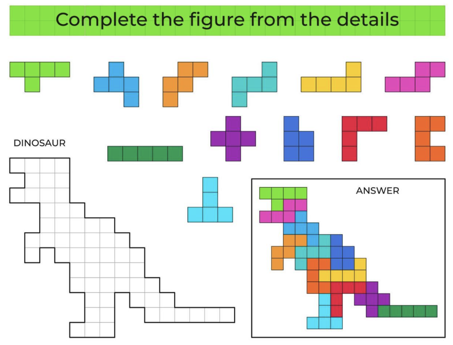

# Chat completo para la obtención del HTML

**Objetivo:** selección de una respuesta a una pregunta en un formulario.

---

## Prompt 1

> Quiero crear una UX de solo un archivo HTML (Puede contener JS y CSS dentro del mismo HTML) que consista en una pregunta que el usuario tiene que responder con dos opciones, SI o NO. La forma en la que el usuario debe responder la pregunta es armando un rompecabezas estilo tetris. Entre las piezas disponibles tienen que haber piezas para las dos opciones (Si o No) y deben estar mezcladas, pero tiene que ser facil diferenciarlas. La dificultad debe ser facil (4 o 5 piezas) El usuario tiene que clickear una por una las piezas y arrastrarlas al rectangulo donde va la respuesta y colocarla en la posicion correcta. Cuando el rompecabezas este completo y todas las piezas son de la misma opcion el usuario puede avanzar a la siguiente pantalla. La imagen es un ejemplo de un rompecabezas con forma de dinosaurio, en nuestro caso tiene que ser un rectangulo con la palabra si o no.. Si tenes alguna duda o algo no esta claro hacé preguntas en vez de resolverlo

### Respuesta 1

HTML1

Armé un primer HTML de una sola pieza en el canvas.

Tiene:

- pregunta con opción SÍ / NO
- piezas mezcladas y diferenciadas por color
- rectángulo de respuesta
- drag & drop
- validación: solo avanza si las 4 piezas colocadas son de la misma opción y están en posición correcta.

---

## Prompt 2

> ok, esta bastante bien, pero no todavia. 1) no quiero que cada cuadrado de la pieza tenga una letra, que la palabra se arme con los colores finales de todas las piezas en su lugar. 2) Que las piezas no sean todas lineas iguales. 3) luego de que coloco una pieza no puedo colocar mas. 4) cuando arrastro las piezas las mismas se muestran por atras, deberian pasar por adelante de toda la pantalla.

### Respuesta 2

Actualicé la versión en canvas con esos 4 cambios:

- sin letras en cada cuadrado
- piezas con formas distintas
- permite seguir colocando piezas
- al arrastrar, la pieza pasa por delante de toda la pantalla

---

## Prompt 3

> Bien, ahora, las piezas deben poder ser encastradas sin rotacion completando el rectangulo de respuesta completamente. Las piezas unidas deben dejar ver la palabra si, o no, como en un rompecabezas convencional en el cual al final de unir todas las piezas se puede observar una imagen. parti de la imagen de un rectangulo del mismo tamaño del rectangulo respuesta con la palabra (si o no) y partilo en 4 o 5 piezas y esas piezas deben der las piezas disponibles

### Respuesta 3

Listo, actualicé el canvas.

Ahora cada pieza es un recorte real del rectángulo final, y al encastrar las 5 piezas se recompone la imagen completa con la palabra SÍ o NO.

---

## Prompt 4

> ok buenisimo! ahora podrias hacer que las piezas dispobibles se muestren dentro del cuadro de las piezas disponibles? algunas salen por fuera del mismo

### Respuesta 4

Ajusté el layout para que todas las piezas queden contenidas dentro del panel de "Piezas disponibles".

Cambios:

- aumenté la altura del área de piezas
- redistribuí las posiciones iniciales para evitar desbordes y superposiciones visuales

---

## Prompt 5

> se salen para los costados mas que para abajo

### Respuesta 5

Ajusté las posiciones horizontales iniciales de las piezas para que no se salgan por los costados del panel de piezas disponibles.

---

**Fin.**
